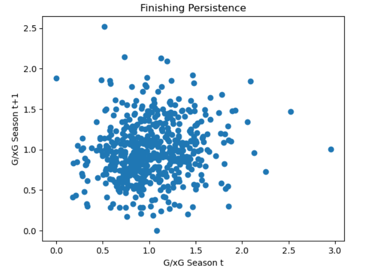
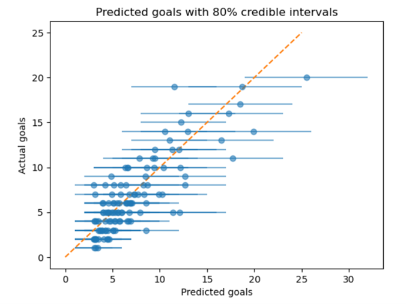
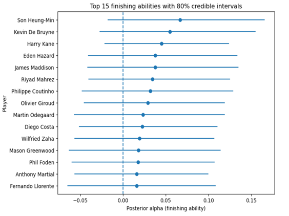
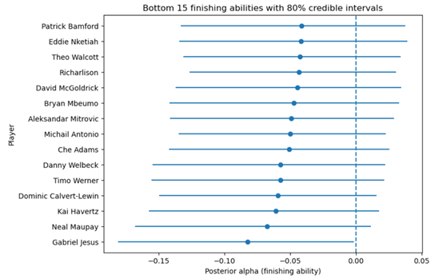
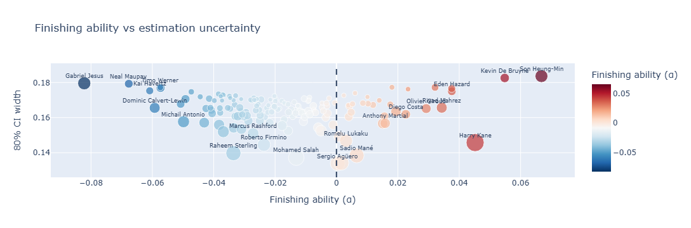

# Bayesian-finishing-skill-model
Bayesian hierarchical model to separate finishing skill from xG and identify sustainable goalscoring performance in the Premier League (2014-2023).
## Overview

Raw goal tallies and G/xG ratios are noisy signals. A player who scores 18 goals from 12 xG in one season is more likely regressing to the mean than a genuine elite finisher — but how much more likely? This project builds a principled statistical framework to answer that, using partial pooling to shrink low-sample player estimates toward the league average while allowing high-exposure players to deviate with confidence.

**Key finding:** Finishing skill is real but small. Even the highest-ranked finisher in the model (Son Heung-Min) is estimated to be only ~6.6% more clinical than a league-average player. Chance quality (xG) remains the dominant driver of goalscoring output — with significant implications for how recruitment departments should interpret short-term xG overperformance.

---

## Repo Structure

```
├── FinishingForecast.ipynb   # Full modelling pipeline (see sections below)
├── README.md
└── data/
    └── player.csv            # Understat EPL player data (Kaggle) — add locally, not tracked
```

> **Note:** `player.csv` is not included in this repo. Download the Understat EPL dataset from [Kaggle](https://www.kaggle.com/) and place it in `data/` before running.

---

## Methodology

### 1. Data & Filtering
- Understat Premier League player data, 2014–2023
- Per-season filters: ≥900 minutes, ≥20 shots, ≥3 npg, outfield players only
- Result: 950 observations across 404 individual players
- Train/test split: 2014–2022 training, 2023 held out for out-of-sample evaluation

### 2. Finishing Persistence Test
Before modelling, year-on-year G/xG correlation is measured across consecutive seasons. The weak result (r = 0.14) confirms that raw finishing ratios are heavily noise-driven — motivating a shrinkage-based approach over naive G/xG comparisons.



### 3. Baseline Model
xG used as a direct predictor of non-penalty goals, assuming all players finish at the league average rate. Establishes the MAE/RMSE benchmark.

### 4. Bayesian Hierarchical Model (Poisson)
Each player is assigned a latent finishing parameter **α** estimated via partial pooling:

$$\log(\mu_i) = \alpha_{\text{player}} + \log(\text{xG}_i)$$

The xG term acts as an exposure offset. Low-sample players are shrunk toward the population mean; high-exposure players can deviate more freely. A non-centred parameterisation is used for better MCMC geometry.

- **α > 0** → above-average finisher
- **α < 0** → underperforms xG relative to the league

### 5. Model Comparison
A Negative Binomial variant (with overdispersion parameter φ) is fitted alongside the Poisson model. Despite evidence of overdispersion in the raw data, the Poisson hierarchical model outperforms on out-of-sample metrics — suggesting that player-level partial pooling accounts for much of the apparent variance without requiring a more complex likelihood.

Models compared using MAE, RMSE, and LOO-CV (ELPD).

| Model | MAE | RMSE | ELPD (LOO) |
|---|---|---|---|
| xG baseline | 1.893 | 2.490 | — |
| Negative Binomial | 1.865 | 2.458 | −1896.24 |
| **Poisson hierarchical** | **1.839** | **2.417** | **−1845.34** |



### 6. Player Profiling
Shot volume (shots/90) vs shot quality (xG/shot) scatter, coloured by posterior α, allowing players to be characterised across three dimensions simultaneously — useful for distinguishing high-volume scorers from elite chance-selectors from genuine finishers.

---

## Results

Players are ranked by posterior mean α with 80% credible intervals. Wide intervals indicate high uncertainty — these players should be treated cautiously in recruitment contexts regardless of their point estimate.

**Top finishers (selected):** Son Heung-Min, Kevin De Bruyne, Harry Kane, Eden Hazard  
**Bottom finishers (selected):** Gabriel Jesus, Neal Maupay, Kai Havertz, Dominic Calvert-Lewin





The finishing ability vs estimation uncertainty plot below is particularly useful for recruitment: it surfaces both the signal *and* the confidence in that signal for every player in the dataset.



---

## Recruitment Implications

- **Regression risk flagging:** Players significantly overperforming xG over short windows are likely candidates for goal-return regression — the model quantifies how much regression to expect
- **Contextualising output:** Separates players who score through volume/chance generation (Salah) from those with genuine finishing edge (Son, Kane)
- **Uncertainty-aware decisions:** Credible intervals attach a confidence level to every estimate — a player with a wide CI is a riskier bet than their point estimate implies

---

## Limitations

- **Static α:** Finishing ability is assumed fixed across the full training window. A time-varying or recency-weighted model would better reflect development trajectories and be more appropriate for recruitment use
- **Team context:** No team-level effects are included; players on defensive teams systematically face lower xG, which may affect their estimates
- **Shot quality:** The dataset uses aggregate xG rather than shot-level data. Access to xGOT or post-shot xG would allow more granular finishing analysis

---

## Stack

```
Python 3.11
pymc 5.x        — Bayesian model estimation (NUTS sampler)
arviz           — posterior diagnostics and LOO-CV
pandas / numpy  — data processing
matplotlib      — static visualisations
plotly          — interactive player profile charts
scikit-learn    — MAE / RMSE evaluation
```

---

## Running the Notebook

```bash
# Clone and set up environment
git clone https://github.com/<your-username>/bayesian-finishing-model.git
cd bayesian-finishing-model

pip install pymc arviz pandas numpy matplotlib plotly scikit-learn

# Add player.csv to data/ then launch
jupyter notebook FinishingForecast.ipynb
```

> PyMC sampling is computationally intensive. Expect ~5–10 minutes per model on a standard laptop. `random_seed=42` is set throughout for reproducibility.

---

## Author

**Morgan Dunne** — Financial Mathematics & Actuarial Science, University College Cork  
[LinkedIn](https://linkedin.com/in/morgan-dunne) · morgandunne5@gmail.com
